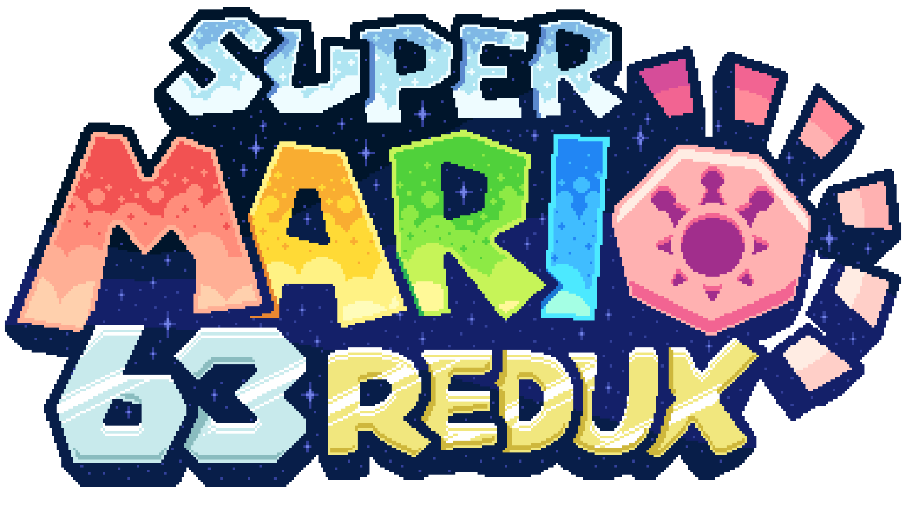

# Super Mario 63 Redux

  

## Remake of Super Mario 63
Super Mario 63 Redux is intended to be a full remake of the original [Super Mario 63 by Runouw](http://runouw.com/games/sm63/), aiming to improve upon the game's presentation and features, while retaining its core mechanics and charm.

## Made in the Godot Engine
SM63 Redux is built in the [Godot Engine](https://godotengine.org/), rather than Flash Player. This allows us to produce a clean, reliable game that to port to a range of different platforms, including Android and Web.

## Getting the game
The game can be found on our website, on the [downloads page](https://sm63redux.com/game), or on our [itch.io page](https://creyon.itch.io/sm63redux).
